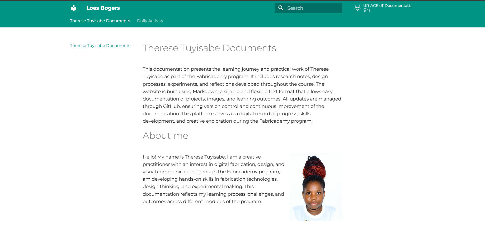
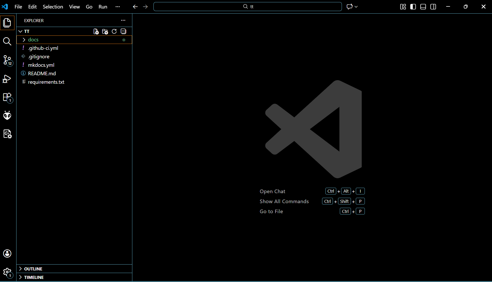
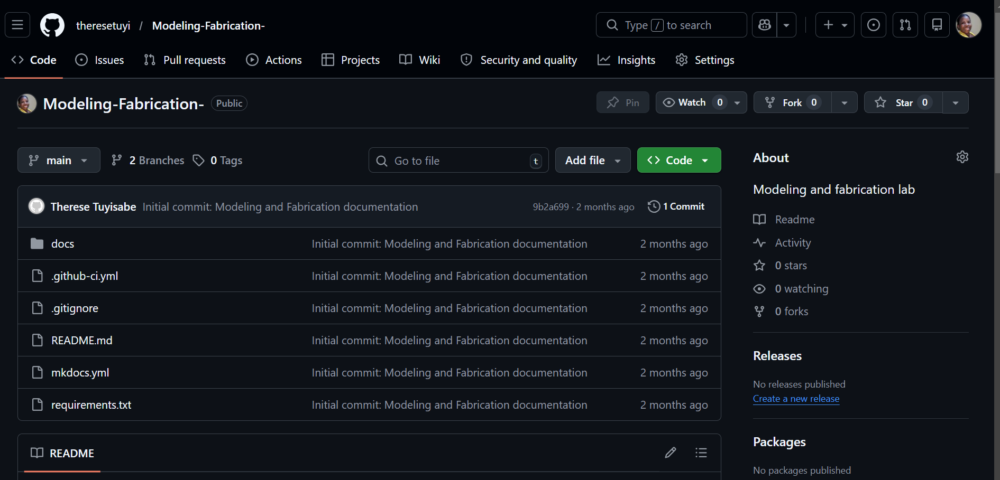
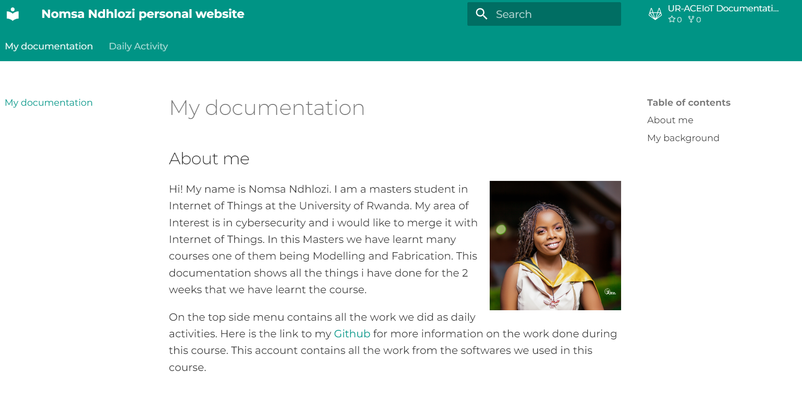

# Activity1.Foundations of Modeling & Fabrication
## Introduction
On Day 1, we explored the foundations of modeling and fabrication. I learned that 
modern design is computational and material aware fabrication is not a final step 
but shapes decisions from the beginning. Modeling represents logic, behavior, and 
design intelligence, not just form.

The design-to-fabrication continuum covers designing, modeling, prototyping, 
fabricating, and evaluating. This process is iterative, and failure is part of 
learning. Fabrication paradigms include subtractive, additive, formative, and hybrid 
methods each must be considered early in the workflow.

Materials and tolerance introduced the idea that real-world fabrication has 
imperfections and limits. Designers must anticipate these rather than assume perfect 
conditions. The session ended with a discussion on ethics and sustainability — not 
everything that can be fabricated should be produced.
## Activity 1: Building a Documentation Website with MkDocs
My lecturer provided a `requirements.txt` file that included MkDocs and the Material 
theme. I ran the file to set up the documentation website, then opened it in VS Code 
to start editing.

The site was already structured with separate pages for each day's activity. I edited 
each day's content in VS Code, then ran `mkdocs serve` to preview my changes locally 
in the browser.

**My MkDocs site running locally:**

## Activity 2:Publishing via GitHub Pages
I published my site online using GitHub and GitHub Pages. I pushed my files to a
repository and used `mkdocs gh-deploy` to make the site publicly accessible. This
introduced me to version control and public knowledge sharing.

**My project files in VS Code:**

**My GitHub repository:**

## Activity 3:Peer Review
I reviewed a classmate's documentation site and learned how clear screenshots and
step-by-step explanations make work easier to follow and reproduce.
**Classmate's documentation site:Nomsa Ndhlozi**

## References & Inspiration
- Course slides: Foundations of Modeling & Fabrication
- MkDocs Material documentation
- GitHub Pages publishing workflow