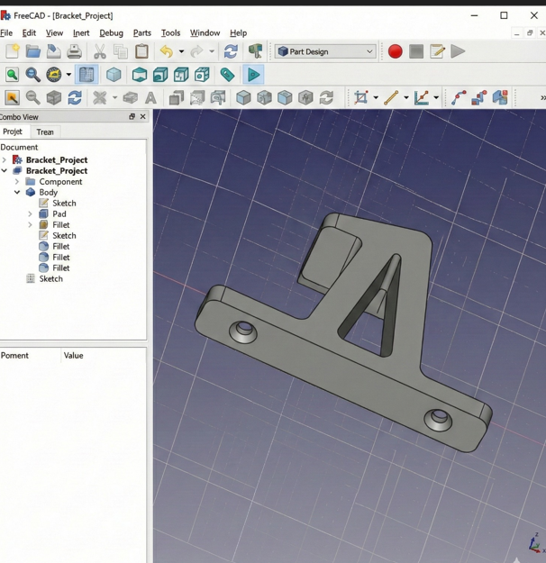
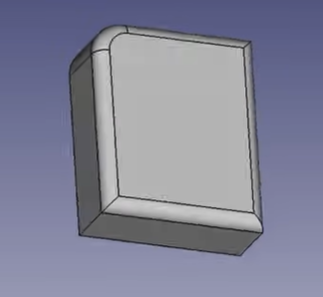

# Activity2. Digital Modeling for Fabrication

## Introduction

Day 2 focused on digital modeling for fabrication and how precise models 
become production-ready files. A digital model is not only a visual object 
but a set of machine instructions — machines execute exactly what is defined, 
so errors in geometry or scale lead directly to fabrication failure.

I learned about precision modeling, scale control, and Design for Manufacturing 
(DFM) principles, which encourage designing objects that respect machine limits 
and material behavior. Fabrication-ready geometry must be closed and watertight 
for 3D, and clean and continuous for 2D.

I also learned about tolerances — digital models assume perfection, but real 
fabrication introduces kerf, shrinkage, and tool wear. Designing for these 
imperfections is necessary to ensure parts assemble correctly.

## Activity 1 — L-Shaped Mounting Bracket in FreeCAD

In this activity I created a 3D L-shaped mounting bracket using FreeCAD.
FreeCAD is a parametric 3D modeling software used to design precise objects
for fabrication. The goal was to recreate the bracket shown below using
sketching, padding, and detail features.

**Reference model we had to recreate:**

**Step 1: Opening FreeCAD and starting a new sketch:**

I opened FreeCAD and selected the Part Design workbench. I created a new
body and started a sketch on the top plane. The sketcher workspace opened
with the Solver messages, Constraints, and Elements panels on the left side.
At this stage the sketch was empty and ready for drawing.

**Step 2: Drawing the L-shape and applying constraints:**

I drew the L-shaped profile of the bracket by placing lines to form the
outline. After drawing, I assigned dimensions to control the exact size of
each edge. I also applied geometric constraints such as parallel, vertical,
horizontal, and perpendicular to fully define the sketch. A fully constrained
sketch turns green, meaning no part of it can move unexpectedly.

**Step 3:Applying padding to create the 3D shape:**

Once the sketch was fully constrained, I used the Pad feature to extrude
the 2D sketch into a 3D solid. Padding gives the flat profile a thickness,
turning it into a real 3D object that can be physically fabricated.

**Step 4: Adding holes, fillets and final details:**

After padding, I added more features to match the reference design. I used
Pocket to cut holes into the bracket for mounting purposes. I then applied
Fillets to round off sharp edges, which improves the strength and appearance
of the part.

## Activity 2:2D Vector Press-Fit Box Panel in Inkscape

In this activity I used Inkscape to design a 2D press-fit box panel. The goal
was to create a flat rectangular panel with rectangular slots sized to match
material thickness so panels can slide and lock together.

I designed the panel using accurate 1:1 scale vector paths. Slot sizing and
clean geometry were critical to ensure parts would assemble correctly in
physical material. I applied grid lines to estimate spacing for holes and cuts.
I drew rectangles for all parts, then used **Path → Difference** to cut slots.
For circular edges, I drew circles, applied **Union** to join them, then used
**Difference** again with smaller circles to finish the design.

**Final press-fit panel design:**

## References
- Digital Modeling for Fabrication lecture slides
- FreeCAD parametric modeling workflow
- Inkscape vector fabrication workflow