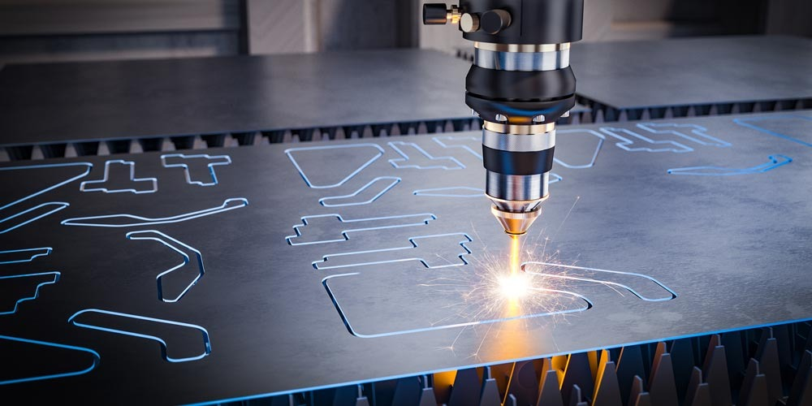

# Activity 3.PCB Milling Techniques & Fabrication Process

## Introduction

KiCad is a free, open-source PCB design tool that supports the entire process
from schematic creation to fabrication-ready outputs. The workflow begins with
designing a clear and accurate schematic, assigning correct footprints to
components, and arranging them on the PCB layout. Proper component placement
and thoughtful routing improve signal integrity and ensure the board fits its
intended physical constraints.

Design for Manufacturability (DFM) is essential throughout the layout process.
Design Rule Checks (DRC) help identify errors such as clearance violations and
unconnected nets before fabrication. When designing for PCB milling, special
attention must be given to wider traces, increased spacing, fewer vias, and
single-sided boards to match the limitations of milling machines.

The final stage involves generating Gerber and drill files, which are used by
PCB mills and manufacturers. These files should always be inspected using a
Gerber viewer to catch errors early.

## After Class Activity Single-Sided Microcontroller PCB Design using KiCad

In this activity I designed a single-sided microcontroller PCB using KiCad.
The goal was to design an ATtiny45 LED Control circuit with a Push Button and
ISP Programming header, suitable for PCB milling and hand soldering.

## Schematic Design
I started by drawing the circuit schematic in KiCad. I placed the ATtiny45
symbol and added the following components:

- LED and resistor for output control
- Push button for input
- Power connector
- 6-pin ISP header for programming
- 0.1µF decoupling capacitor between VCC and GND to stabilize power supply

**Schematic design in KiCad:**

## Assigning Footprints

Every component was assigned to its footprint. Assigning footprints is
important because it connects schematic symbols to the physical components
that will be mounted on the PCB. Footprints define the real size, pad layout,
and spacing of components, ensuring they fit correctly and can be soldered
reliably.

**Footprint assignment view:**

## PCB Layout and Routing

After completing the schematic, I moved to the PCB layout editor. I placed
all components on the board and routed the connections manually using a
single-sided routing strategy to avoid vias and minimize jumpers.

I positioned the ISP header close to the microcontroller, placed the LED
at the board edge for visibility, and kept a logical signal flow across
the board. After routing, I ran the Design Rule Check (DRC) to confirm
there were no clearance violations or unconnected nets.

**3D view of the final PCB:**

## Fabrication Machine Unavailable

The next step would have been to mill the PCB using the CNC milling machine,
which cuts copper traces into the board based on the Gerber files exported
from KiCad. However, the milling machine was not working at the time of this
activity, so the physical board could not be produced.

The image below shows what the PCB milling process looks like:

The Gerber and drill files were successfully generated and are ready to be
used once the machine is available.

## References
- PCB Designing with KiCad – From Schematic to Fabrication-Ready PCB
- ATtiny45 microcontroller datasheet
- KiCad DRC and Gerber export workflow
- [Download KiCad folder](../files/kicad/)
- [Download Gerber files](../files/gerber/)