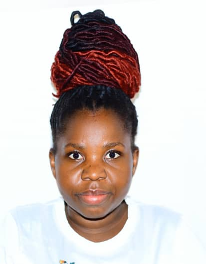

# Therese Tuyisabe Documents
This documentation presents the learning journey and practical work of Therese Tuyisabe as part of the Fabricademy program. It includes research notes, design processes, experiments, and reflections developed throughout the course.
The website is built using Markdown, a simple and flexible text format that allows easy documentation of projects, images, and learning outcomes. All updates are managed through GitHub, ensuring version control and continuous improvement of the documentation.
This platform serves as a digital record of progress, skills development, and creative exploration during the Fabricademy program.
# About me
{ width=200 align=right }
Hello! My name is Therese Tuyisabe. I am a creative practitioner with an interest in digital fabrication, design, and visual communication. Through the Fabricademy program, I am developing hands-on skills in fabrication technologies, design thinking, and experimental making.
This documentation reflects my learning process, challenges, and outcomes across different modules of the program. 

## My background
I was born and raised in Kigali, where my interest in creativity, design, and technology began. My background continues to influence my approach to making, combining local context with digital fabrication techniques.

  

